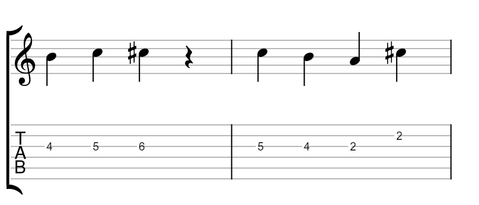
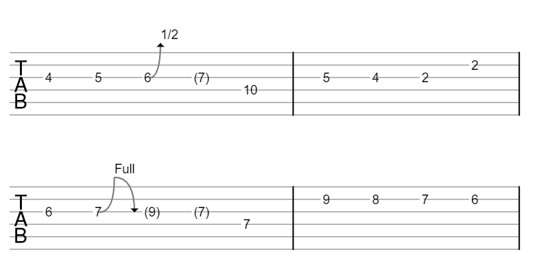

# Obsidian Vextab

This is an [Obsidian](https://obsidian.md) plugin for rendering guitar tablature and music notation using [Vextab](https://vexflow.com/vextab/). From the Vextab creators:

> VexTab is a language that allows you to easily create, edit, and share standard notation and guitar tablature. Unlike ASCII tab, which is designed for readability, VexTab is designed for writeability. 

## Installation
### Option 1: Install in Obsidian (recommended)
The recommended way to install this plugin is through the Obsidian Community Plugins browser. To do so, open the settings in Obsidian and go to Community Plugins->Browse, then search for "Vextab". Click "install" and "enable" to enable the plugin.

Alternatively, you can install it manually using one of the following methods:

### Option 2: Install lastest release
Go to the [latest release](https://github.com/luigman/obsidian-vextab/releases/latest) and download the file that looks like `obsidian-vextab-X.X.X.zip`.

Unzip this file in the `.obsidian/plugins/` directory inside your vault. You may need to enable *show hidden files* in your file browser to see this folder.

Then restart Obsidian and activate Vextab in the Community Plugin settings

### Option 3: Manual build
Go to `.obsidian/plugins/` and run the following commands:
```
git clone https://github.com/luigman/obsidian-vextab.git
cd obsidian-vextab
npm run deploy
```
Then restart Obsidian and activate Vextab in the Community Plugin settings

## Getting started
To render your first tab, create a new `vextab` code block and enter your notation. For example, this:
````
```vextab
tabstave notation=true
notes 4-5-6/3 ## | 5-4-2/3 2/2
```
````

will be rendered to this:



You can use either the `vextab` or `tab` keywords to create a vextab code block.

### Vextab tutorial
Check out the [Vextab tutorial](https://vexflow.com/vextab/tutorial.html) for more examples and a guide on how to write vextab

### Quicktab
This plugin also defines a shorthand notation for creating vextab, which is useful for jotting down quick ideas, especially on mobile. The shorthand notation will be applied to `quicktab` code blocks and modifies your notation in the following way:
- `tabstave` is inferred on the first line and a new tabstave is inserted after any double-newline
- if a line does not start with `notes`, `text`, or `options`, it is inferred to contain notes.

For example, this:
````
```quicktab
4-5-6b7/3 10/4 | 5-4-2/3 2/2

6-7b9b7/3 7/4 | 9-8-7-6/2
```
````
gets converted to this
````
```tab
tabstave
notes 4-5-6b7/3 10/4 | 5-4-2/3 2/2

tabstave
notes 6-7b9b7/3 7/4 | 9-8-7-6/2
```
````
and results in the following image:



You can toggle whether to include notation in quicktab in the Vextab plugin settings.

## Troubleshooting
There is a known incompatibility with the Scales and Chords plugin, since they both use `tab` code blocks. For now, ensure that only one of these plugins is enabled at a time. A future version of this plugin will include the option to disable `tab` code blocks in favor of using `vextab`.
